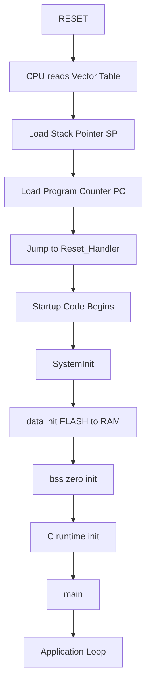
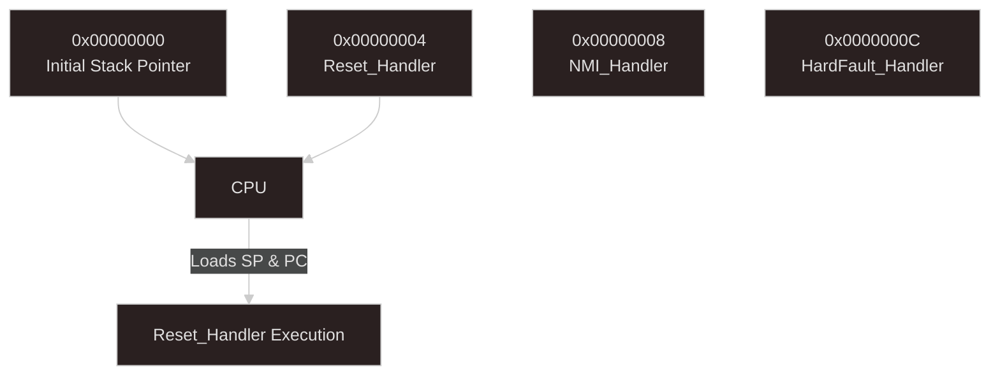
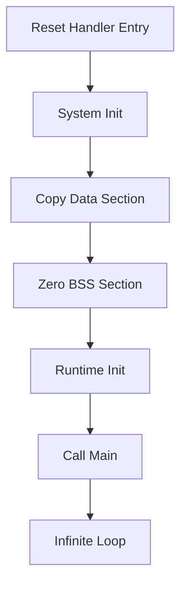
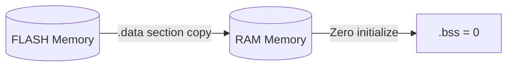
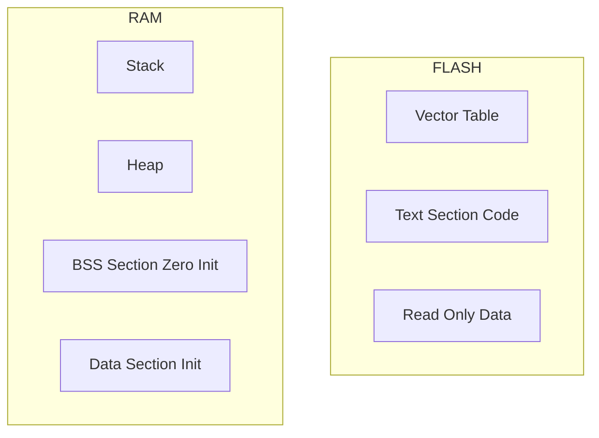
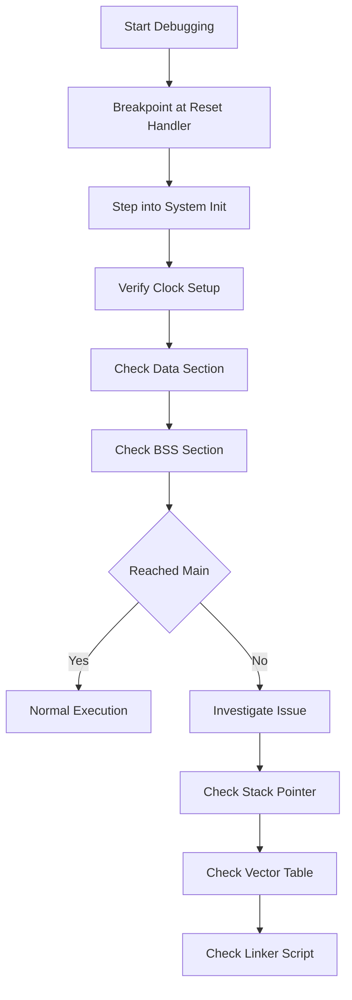

# 🔍 Reset to `main()` — Deep Execution Flow

This document provides a **low-level, execution-focused breakdown** of what happens from **MCU reset to `main()`**, including **startup code behavior, memory operations, and debugging insights**.

> This is the actual flow followed in real firmware systems — not a simplified textbook version.

---

## 🧠 Why This Matters

Understanding this flow helps you:

* Debug systems that **never reach `main()`**
* Fix **HardFaults at startup**
* Understand **linker + memory behavior**
* Work confidently with **startup code (`startup.s`)**

---

## ⚡ Complete Execution Flow



## 🧱 Step 1: Reset Occurs

### 🔹 Sources

* Power-On Reset
* External Reset Pin
* Watchdog Reset
* Software Reset

---

### 🔹 Hardware Behavior

Immediately after reset:

* CPU enters privileged mode
* Interrupts are disabled
* Clock = default internal oscillator
* Execution starts from:

```md
`0x00000000`
```
---

## 📌 Step 2: Vector Table Read

### 📍 Located at:

```
Flash Base Address
```

### Structure:

```
Address       Content
--------------------------------
0x00000000 → Initial Stack Pointer
0x00000004 → Reset_Handler
0x00000008 → NMI_Handler
0x0000000C → HardFault_Handler
...
```

---

### 🔥 Critical CPU Actions

```c
SP = *(0x00000000);
PC = *(0x00000004);
```

👉 CPU jumps directly to `Reset_Handler`

---

## 🚀 Step 3: Enter Reset_Handler


This is the **true firmware entry point**.

---

### 🧩 Typical Startup Code (Simplified)

```c
void Reset_Handler(void)
{
    SystemInit();
    __initialize_data();
    __initialize_bss();
    __libc_init_array();  // for C/C++
    main();

    while (1); // fallback
}
```

---

## ⚙️ Step 4: SystemInit()

### Purpose:

Bring hardware out of **safe reset state**.

---

### 🔧 Typical Tasks

* Configure system clock (PLL, oscillator)
* Setup Flash wait states
* Enable FPU (if present)
* Configure vector table offset (VTOR)

---

### ⚠️ Common Bugs

* Wrong clock → peripherals fail
* Flash latency misconfigured → crash
* PLL not locked → unstable system

---

## 📦 Step 5: `.data` Section Initialization


### 🔹 What is `.data`?

Initialized global/static variables.

```c
int x = 10;  // stored in .data
```

---

### 🔹 What happens?

```
FLASH  →  RAM
```

---

### 🧩 Code Representation

```c
uint32_t *src = &_sidata; // flash
uint32_t *dst = &_sdata;  // ram

while (dst < &_edata)
{
    *dst++ = *src++;
}
```

---

### ⚠️ If this fails:

* Variables get garbage values
* System behaves unpredictably

---

## 🧹 Step 6: `.bss` Initialization

### 🔹 What is `.bss`?

Uninitialized global/static variables.

```c
int counter;  // should be 0
```

---

### 🔹 What happens?

```
RAM = 0
```

---

### 🧩 Code Representation

```c
uint32_t *dst = &_sbss;

while (dst < &_ebss)
{
    *dst++ = 0;
}
```

---

### ⚠️ If this fails:

* Variables contain random values
* Logic breaks silently

---

## 🧠 Step 7: C Runtime Initialization

### 🔹 Responsibilities

* Initialize global/static variables
* Call C++ constructors
* Prepare runtime environment

---

### 🔧 Function Used

```c
__libc_init_array();
```

---

## 🔁 Step 8: Jump to `main()`

```c
main();
```

---

### 🧩 After This Point

* Drivers are initialized
* Peripherals configured
* Infinite loop starts

---

## 🧱 Memory Layout (Runtime View)


---

## ⚠️ Real Debugging Scenarios

### ❌ 1. Code Never Reaches `main()`

Possible causes:

* Wrong vector table address
* Stack pointer invalid
* Crash inside Reset_Handler

---

### ❌ 2. HardFault Immediately

* Invalid memory access
* Misaligned stack
* Incorrect linker script

---

### ❌ 3. Variables Incorrect

* `.data` not copied
* `.bss` not zeroed

---

### ❌ 4. Peripheral Not Working

* Clock not initialized
* SystemInit() failure

---

## 🔍 Debugging Strategy (Industry Practice)

### ✅ Step-by-step

1. Set breakpoint at `Reset_Handler`
2. Step through:

   * SystemInit()
   * .data copy
   * .bss init
3. Verify:

   * RAM contents
   * Stack pointer location

---

### ✅ Inspect in Debugger

* Check memory at `.data`
* Check `.bss` is zero
* Verify PC flow

---

## 💡 Key Takeaways

* `Reset_Handler` is the real entry point
* Memory initialization is **critical**
* Linker script defines everything
* Most startup bugs occur **before `main()`**

---

## 🔗 Related Notes

* Boot Overview → `BOOT_FLOW.md`
* Memory Layout → `SYSTEM_ARCHITECTURE_&_MEMORY_MAP.md`
* Clock Issues → `CLOCK_SYSTEM.md`
* Debugging → `debugging-peripherals.md`

---

## 🧠 Final Insight

> If you can debug before `main()`,
> you are no longer a beginner in embedded systems.
